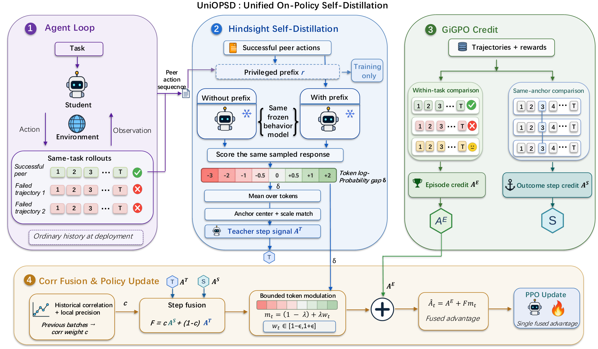

# UniOPSD

Complete training and evaluation source for the correlation-guided (`corr`) UniOPSD configuration with successful-peer hindsight. The repository includes the distributed trainer, rollout and policy-update workers, environment adapters, data preparation, retrieval service, model export utility, and configurations for Qwen2.5 3B/7B on ALFWorld, WebShop, and Search-QA.



## Layout

- `uniopsd/`: public training and evaluation entry points.
- `verl/trainer/ppo/rlsd_ray_trainer.py`: peer selection, teacher scoring, historical correlation, local credit fusion, and the training loop.
- `verl/trainer/ppo/rlsd_utils.py`: step-credit and token-advantage operations.
- `gigpo/core_gigpo.py`: episode and anchor-relative outcome credit.
- `verl/workers/`: distributed model execution and optimizer updates.
- `agent_system/`: interaction prompts, rollout collection, rewards, and environment implementations.
- `verl/trainer/config/*_corr_*.yaml`: six task/model configurations.
- `scripts/`: setup, data preparation, training, evaluation, retrieval, and checkpoint export.

## Installation

Use Linux, Python 3.12, a CUDA-compatible driver, and the appropriate GPU runtime. The supplied training defaults use one node with eight GPUs; the experiments used eight A100 80GB GPUs. The reference software stack is PyTorch 2.8.0, vLLM 0.11.0, Transformers 4.57.3, TensorDict 0.10.0, and Ray 2.50.0.

Create and activate your own virtual environment, then run:

```bash
bash scripts/setup_environment.sh
```

WebShop additionally requires Java 11 for Lucene and the `en_core_web_sm` spaCy model:

```bash
python -m spacy download en_core_web_sm
```

The trainer uses the vendored environment adapters. Optional upstream modules are retained for compatibility; the supported release launchers target the three environments listed above.

## Data preparation

ALFWorld and WebShop use placeholder training rows because tasks come from the environment during rollout:

```bash
python scripts/prepare_data.py agent
export ALFWORLD_DATA="$PWD/data/alfworld"
alfworld-download
python scripts/setup_webshop.py --download --build-index
```

Search-QA uses the public Natural Questions/HotpotQA data:

```bash
python scripts/prepare_data.py search
```

For Search-QA retrieval, obtain the public wiki-18 corpus, the compatible E5 FAISS index, and an E5 encoder checkpoint. Supply their local paths when starting the bundled retrieval service:

```bash
bash scripts/start_retriever.sh   --index_path data/search/e5_Flat.index   --corpus_path data/search/wiki-18.jsonl   --retriever_model intfloat/e5-base-v2
```

The dense encoder uses a GPU. Set `RETRIEVAL_ADDRESS` locally to the complete address of this service, including its `/retrieve` route, before starting Search-QA. No service address or credential is supplied in the repository. Public models and benchmark data are downloaded separately; checkpoints, raw corpora, prebuilt indexes, and historical training logs are not source-code assets.

## Training

```bash
bash scripts/train.sh alfworld 3b
bash scripts/train.sh webshop 7b
bash scripts/train.sh search 3b
```

Use `alfworld`, `webshop`, or `search` with `3b` or `7b`. Inspect the resolved settings without starting training:

```bash
bash scripts/train.sh alfworld 3b --cfg job --resolve
```

Hydra overrides are passed through, for example:

```bash
bash scripts/train.sh alfworld 3b   actor_rollout_ref.model.path=models/Qwen2.5-3B-Instruct   trainer.total_training_steps=150   trainer.default_local_dir=checkpoints/alfworld_corr_3b
```

The launchers enforce `teacher=peer`, `form=fusion`, and `c_mode=corr`. Skill files are not required. Correlation state from previous batches determines the current weights; teacher construction reuses successful peers from the sampled group. Logging defaults to the console, and resuming is disabled unless explicitly requested. Training defaults retain 150 updates and validate every five updates. Resource settings can be overridden, but model-parallel and minibatch divisibility constraints must remain compatible.

## Evaluation and checkpoint export

Evaluate a distributed checkpoint directory containing the actor state:

```bash
bash scripts/evaluate.sh alfworld 3b   trainer.resume_from_path=checkpoints/alfworld_corr_3b/global_step_150
```

The evaluation entry point enables validation-only mode and disables checkpoint writing. To evaluate an exported model, set `actor_rollout_ref.model.path` and leave `trainer.resume_from_path` unset. ALFWorld/WebShop validation samples at temperature 0.4; Search-QA uses deterministic decoding. For larger evaluation sets, adjust `data.val_files` and `data.val_batch_size`.

Export an FSDP actor checkpoint:

```bash
python scripts/model_merger.py merge --backend fsdp   --local_dir checkpoints/alfworld_corr_3b/global_step_150/actor   --target_dir models/uniopsd_corr_3b
```

## Validation and provenance

The release is a source distribution, not a bundle of model weights or experiment outputs. Configuration composition, Python/shell syntax, and available CPU checks are validated during packaging; full distributed training must be run with the required GPUs and benchmark assets. The historical experiments are not rerun as part of packaging.

This project builds on verl, verl-agent/GiGPO, SDAR, ALFWorld, WebShop, and the bundled Search-QA environment. Upstream copyright notices and applicable licenses are retained. Project-maintainer contact metadata, private paths, service addresses, credentials, and Git history are excluded from this release. See `LICENSE`, `Notice.txt`, and applicable vendored notices for license terms.

## Citation

If you use UniOPSD in your research, please cite our [paper](https://arxiv.org/abs/2609.34810):

```bibtex
@misc{fu2026uniopsd,
  title         = {{UniOPSD}: Unifying Outcome and Hindsight Feedback for Agentic Reinforcement Learning},
  author        = {Fu, Zenghuang and Li, Zhaoyang and Ai, Qiuyuan and
                   Han, Xiaofeng and Zheng, Zelong and Wu, Haoyu and
                   Fu, Tianyu and Zhao, Chenxu and Wu, Minghui and
                   He, Guannan and Wang, Changwei},
  year          = {2026},
  eprint        = {2609.34810},
  archivePrefix = {arXiv},
  primaryClass  = {cs.AI},
  url           = {https://arxiv.org/abs/2609.34810}
}
```
